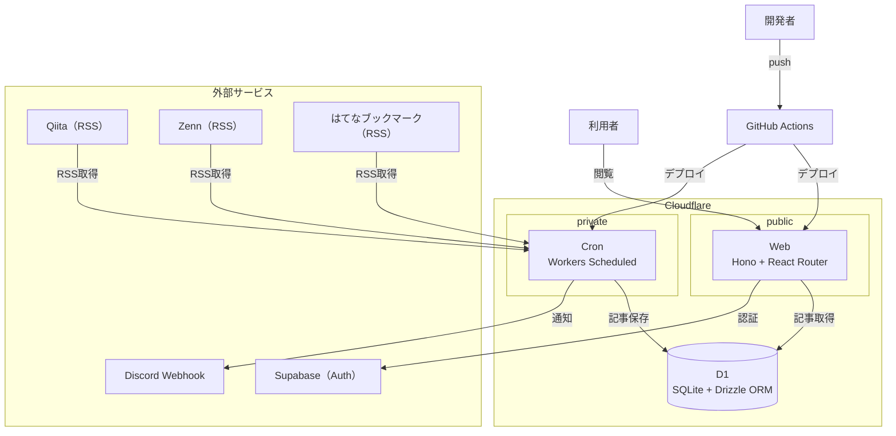

## システム構成図

## システム構成

- **Web**: Hono + React Router（Cloudflare Workers）
- **Cron**: RSS取得（Cloudflare Workers Scheduled）。Qiita / Zenn / はてなブックマークのフィードを取得する
- **Database**: Cloudflare D1（SQLite互換）+ Drizzle ORM
- **Auth**: Supabase
- **Notification**: Discord Webhook
